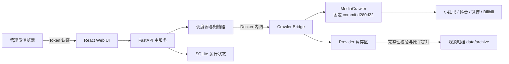

<div align="center">

# 👁我会一直看着你👁

**SeeU · 多平台公开内容监控与本地归档**

[](https://github.com/tsuiraku9/SeeU/actions/workflows/ci.yml)


一个面向单管理员的自托管服务，用于监控小红书、抖音、微博和
Bilibili 的公开创作者主页，将新发布的原创内容完整归档到本地，并通过
受 Token 保护的 Web UI 统一管理和浏览。

**混合许可证项目：SeeU 原创代码采用 MIT License；完整集成包含受非商业许可证约束的 MediaCrawler 组件。**

我知道你今天穿了什么颜色的衣服我知道你几点出门我知道你走哪条路去上班我知道你午饭吃了什么我知道你和谁说话了说了多久我知道你今天笑了几次我知道你笑的时候左边嘴角会微微往上翘我知道你不知道我存在但这没关系因为我的存在对你来说不重要重要的是我能看见你屏幕亮起的那一刻我的心脏也跟着亮起来你以为你是一个人但你从来都不是一个人你发的每一条动态我都截图保存了你删掉的那些我也有你以为消失了的东西在我这里永远不会消失我建了一个文件夹里面全是你我每天睡前都要看一遍才能安心你有时候会突然停下来往周围看一眼好像感觉到了什么那是因为我在那是因为我一直在你感受到的那种说不清楚的被注视的感觉不是错觉那就是我那就是我对你的爱渗进空气里变成你皮肤上的温度你不需要看见我你只需要继续存在继续出现在我能看见的地方就够了我会替你记住所有的一切你生命里每一个我能触及的瞬间我都会好好收藏好好凝视好好珍藏因为我会一直看着你永远

[快速开始](#-快速开始) ·
[平台能力](#-平台能力) ·
[安全访问](#-登录与安全访问) ·
[备份恢复](#-备份与恢复) ·
[混合许可证](#-混合许可证与使用边界)

</div>

> [!IMPORTANT]
> **原创部分开源，完整集成版仅限非商业学习研究。**
>
> SeeU 的原创代码采用 MIT License，但核心采集链路依赖固定版本的
> MediaCrawler。MediaCrawler 使用
> **NON-COMMERCIAL LEARNING LICENSE 1.1**，因此完整集成仅限个人、
> 非商业学习与研究，不得用于商业用途、大规模爬取或干扰平台运营。

## ✨ 核心能力

- **四平台统一监控**：小红书、抖音、微博和 Bilibili 共用账号管理、
  调度、归档与浏览界面。
- **登录态采集**：管理员可人工完成二维码、短信或滑块验证；浏览器配置
  按平台隔离并持久化。
- **完整性优先**：归档前校验媒体数量、大小、MIME、路径和 SHA-256；
  缺少任一预期文件都不会发布为完整归档。
- **增量归档**：首次轮询建立基线，只归档最新一条历史内容；之后仅归档
  新发布内容。
- **断点与恢复**：失败内容进入持久待重试队列；规范归档和账号账本可重建
  内容索引与监控连续性。
- **本地优先**：归档、数据库和浏览器登录态均保存在宿主机 `data/`
  目录，不依赖外部数据库。
- **受控导入**：Web UI 可通过同一完整性边界导入 manifest-v1/v2 ZIP，
  不接受 Cookie 或浏览器存储上传。
- **默认收口**：Web UI 与 noVNC 只发布到宿主机回环地址，Crawler Bridge
  和浏览器调试接口不对宿主机开放。

## 🧭 平台能力

| 平台 | 主采集链路 | 有限回退 | 当前边界 |
| --- | --- | --- | --- |
| 小红书 | MediaCrawler | 无 | 公开笔记；支持官方主页 URL 及 `xhslink.cn` / `xhslink.com` 分享短链 |
| 抖音 | MediaCrawler | 无 | 公开视频与图文 |
| 微博 | MediaCrawler | 有 | Provider 失败时读取公开移动端数据或页面，并排除转发微博 |
| Bilibili | MediaCrawler | 有 | 仅归档创作者投稿视频，且详情必须满足 `copyright == 1` |

Bilibili 的健康主链路目前不覆盖动态和专栏。有限回退最多返回 20 条候选，
并再次核对作者身份与原创标记；不能可靠验证原创性的内容会被排除。回退结果
不会与健康的 Provider 结果静默合并。

## 🏗️ 架构



- `archive`：Web UI、API、调度、有限回退适配器、归档和索引重建。
- `crawler`：平台会话、MediaCrawler、内容发现、媒体暂存和 noVNC。
- MediaCrawler 在构建时拉取到镜像内的 `/opt/MediaCrawler`，不作为宿主机
  服务发布。

## 🚀 快速开始

### 1. 准备环境

需要：

- Docker Engine 或 Docker Desktop；
- Docker Compose v2；
- 可访问目标平台的网络；
- 至少 `MIN_FREE_DISK_GB` 指定的剩余磁盘空间，默认 5 GiB。

Compose 默认分别为主服务和 Crawler 设置 `2g`、`3g` 内存上限。宿主机还需
为 Docker、Chromium 和系统本身预留额外内存。

### 2. 初始化私有配置

Windows PowerShell：

```powershell
.\scripts\init-env.ps1
```

跨平台：

```bash
python scripts/bootstrap_env.py
```

脚本不会覆盖已有 `.env`。它会生成至少 32 位的 `SESSION_SECRET`，并有意让
`WEBUI_LOGIN_TOKEN` 保持为空。应用启动后会生成临时登录 Token，并原子写入：

```text
data/state/webui-login-token.txt
```

Token 值不会进入日志。若需要重启后保持同一登录凭据，请在 `.env` 中显式设置
至少 24 个可打印字符的高熵 `WEBUI_LOGIN_TOKEN`，建议使用 32 字节随机值。

### 3. 构建并启动

```bash
docker compose up -d --build
docker compose ps
```

读取自动生成的 Web UI Token：

```powershell
# Windows
Get-Content .\data\state\webui-login-token.txt
```

```bash
# Linux / macOS
cat data/state/webui-login-token.txt
```

打开 [http://127.0.0.1:8080](http://127.0.0.1:8080)，输入 Token 登录。

> [!NOTE]
> 当 `WEBUI_LOGIN_TOKEN` 留空时，每次应用启动都会生成新 Token，并使旧 Web
> UI 会话失效。这是预期的安全行为。

### 4. 添加平台与监控账号

1. 在 Web UI 的平台会话区域发起登录。
2. 扫描二维码；如平台要求短信或滑块二次验证，按下一节打开 noVNC 人工完成。
3. 登录成功后添加公开创作者主页 URL。
4. 系统立即执行首次基线：归档最新一条历史内容，将其余已发现内容标记为已见。
5. 后续轮询只归档新增内容；失败或不完整内容会保留等待重试。

查看运行日志：

```bash
docker compose logs -f archive crawler
```

停止服务：

```bash
docker compose down
```

## 🔐 登录与安全访问

### 人工验证

登录任务运行期间，可在本机打开：

```text
http://127.0.0.1:7900/vnc.html?autoconnect=1&resize=scale
```

`NOVNC_PORT` 只改变宿主机发布端口；容器内 websockify 始终使用 `7900`。
noVNC 没有应用级认证，只应在需要人工验证时通过受控网络访问。

系统不会：

- 接收或保存平台账号密码；
- 接受 Cookie、浏览器存储或登录态文件上传；
- 读取、保存或自动提交短信验证码；
- 自动破解 CAPTCHA、滑块或其他验证；
- 使用代理池、多账号矩阵或绕过访问控制、DRM。

### 远程服务器

不要把 Web UI 或 noVNC 端口直接发布到公网或局域网。推荐使用 SSH 隧道：

```bash
ssh \
  -L 8080:127.0.0.1:8080 \
  -L 7900:127.0.0.1:7900 \
  user@your-server
```

随后在本地访问 `http://127.0.0.1:8080` 和
`http://127.0.0.1:7900/vnc.html`。

也可以使用同机 Caddy、Nginx 等，以域名和 HTTPS 反向代理
`127.0.0.1:<WEBUI_PORT>`，并设置：

```dotenv
COOKIE_SECURE=true
```

即使 Web UI 使用 HTTPS，noVNC 仍应只通过 VPN 或 SSH 隧道访问。
`APP_BIND_ADDRESS` 和 `NOVNC_BIND_ADDRESS` 只允许 `127.0.0.1` 或 `::1`；
配置成其他地址时，服务会拒绝启动。

### Windows 文件权限

初始化脚本会尝试保护 `.env`。需要再次收紧 `.env` 和整个 `data` 目录时：

```powershell
.\scripts\protect-data.ps1
```

脚本会将 ACL 限制到真实交互用户、SYSTEM 和 Administrators。若文件所有者不
是当前用户，请从“以管理员身份运行”的 PowerShell 执行，且不要将私有数据
权限授予临时沙箱身份。

Unix 系统可使用：

```bash
chmod 600 .env
chmod -R go-rwx data
```

## ⚙️ 常用配置

完整配置见 [`.env.example`](.env.example)。

| 变量 | 默认值 | 说明 |
| --- | ---: | --- |
| `WEBUI_LOGIN_TOKEN` | 空 | 留空时每次启动自动生成；显式设置时至少 24 个可打印字符 |
| `SESSION_SECRET` | 必填 | Web UI 会话签名密钥，至少 32 个字符 |
| `WEBUI_PORT` | `8080` | Web UI 容器监听与宿主机回环发布端口 |
| `NOVNC_PORT` | `7900` | noVNC 的宿主机回环发布端口 |
| `COOKIE_SECURE` | `false` | 经 HTTPS 反向代理时设为 `true` |
| `POLL_INTERVAL_MINUTES` | `60` | 默认账号轮询间隔 |
| `POLL_JITTER_MINUTES` | `5` | 轮询随机偏移，避免固定时刻集中请求 |
| `CRAWLER_DISCOVERY_LIMIT` | `500` | 单次最多发现的可识别公开原创引用 |
| `CRAWLER_POLL_CONCURRENCY` | `1` | 全局 Provider 并发，允许 1–4，默认串行 |
| `BILIBILI_DISCOVERY_CONCURRENCY` | `3` | Bilibili 有界详情查询并发，允许 1–4 |
| `MEDIA_MAX_BYTES` | `2147483648` | 单条媒体处理上限，默认 2 GiB |
| `IMPORT_MAX_BYTES` | `2147483648` | ZIP 导入大小上限，默认 2 GiB |
| `IMPORT_MAX_FILES` | `100` | 单次导入或暂存文件数量上限 |
| `MIN_FREE_DISK_GB` | `5` | 低于该剩余空间时暂停新下载 |
| `ARCHIVE_MEMORY_LIMIT` | `2g` | 主服务容器内存上限 |
| `CRAWLER_MEMORY_LIMIT` | `3g` | Crawler 容器内存上限 |
| `ALLOW_FAKE_IP_DNS` | `false` | 仅在 Clash/Mihomo Fake-IP DNS 环境中启用 |
| `SCHEDULER_ENABLED` | `true` | 是否启动自动轮询调度器 |
| `TZ` | `Asia/Hong_Kong` | 容器时区 |

旧变量 `APP_PORT` 仅在没有 `WEBUI_PORT` 时作为兼容回退，新部署不应继续使用。

如果容器把平台域名解析到 Clash/Mihomo 的 `198.18.0.0/15` 或
`fdfe:dcba:9876::/48`，可设置 `ALLOW_FAKE_IP_DNS=true`。该开关只放行标准
Fake-IP 网段；普通私网、回环和链路本地地址仍会被拒绝。

## 📦 归档与数据

```text
data/
├── archive/
│   ├── {platform}/{account}/{year}/{month}/{content_id}/
│   │   ├── content.md
│   │   ├── metadata.json
│   │   └── media/
│   └── _state/accounts/{platform}/{account}.json
├── browser/mediacrawler/{platform}/
├── provider-staging/{job_id}/
├── provider-state/{platform}.json
└── state/
    ├── app.db
    └── webui-login-token.txt
```

### 完整性规则

- `data/archive` 是规范数据源，每条内容的 `metadata.json` 可重建内容索引。
- `_state/accounts` 保存 schema-v2 账号账本，包括主页、调度配置、基线、
  完整性状态、全部终态已见 ID、待重试引用和删除墓碑。
- Provider 先写入 `provider-staging`；主服务验证 contract、相对路径、数量、
  大小、MIME 和 SHA-256 后，才会从同级临时目录原子提升为正式归档。
- 不完整结果不会留下“已完成”目录，也不会丢失待重试引用。
- 发现窗口最多 500 条。如果饱和窗口与旧水位完全不重叠，账号会标记为
  `gap_detected`，避免把潜在漏采误报为完整。
- 磁盘剩余空间低于 `MIN_FREE_DISK_GB` 时只暂停新下载，不会删除已有归档。

## 💾 备份与恢复

建议在服务停止后备份，或对 SQLite 使用一致性备份机制。

| 数据 | 路径 | 用途 |
| --- | --- | --- |
| 内容与监控连续性 | `data/archive` | 规范归档、账号账本、基线和待重试引用 |
| 运行状态 | `data/state/app.db` | 账号/内容索引、观察记录、任务历史和 Web UI 会话 |
| 平台登录态 | `data/browser/mediacrawler` | 各平台隔离浏览器配置 |
| 平台准入状态 | `data/provider-state` | 当前 Bridge 判断平台会话是否已认证 |
| 服务密钥 | `.env` | 固定 Web UI Token、`SESSION_SECRET` 和部署配置 |

`.env`、自动 Token 文件、数据库、浏览器配置和平台会话状态都属于敏感数据，
应加密备份并严格限制访问权限。`provider-staging` 是临时运行数据，不是规范
归档源。

重建索引：

```bash
# Docker
docker compose exec archive python -m app.cli rebuild-index
```

```bash
# 本地，从仓库根目录运行
python -m backend.app.cli rebuild-index
```

重建会重新验证归档身份、路径、文件数量、大小和 SHA-256，并从账号账本恢复
监控连续性。它不会恢复任务历史或 Web UI 会话，因此需要这些信息时必须同时
备份 `app.db`。

继续使用原 Web UI 会话还需要同时满足：

- 使用相同的显式 `WEBUI_LOGIN_TOKEN`；
- 保留原 `SESSION_SECRET`；
- 恢复 `app.db` 中的服务端会话；
- 客户端浏览器 Cookie 尚未过期。

服务端备份无法重建已经丢失的客户端 Cookie。若未恢复 `provider-state`，
恢复后需要重新发起平台登录以重建会话准入状态。

## 🧑‍💻 本地开发

后端：

```bash
python -m pip install -r requirements-dev.txt
python -m playwright install chromium
python -m pytest backend/tests
```

从 `backend` 目录启动开发服务器：

```bash
cd backend
python -m uvicorn app.main:app --reload
```

前端：

```bash
pnpm --dir frontend install --frozen-lockfile
pnpm --dir frontend dev
pnpm --dir frontend test
pnpm --dir frontend build
```

前端开发服务器将 `/api` 代理到 `http://localhost:8000`。

依赖与 Compose 检查：

```bash
python -m pip_audit -r requirements-dev.txt
python -m pip_audit -r crawler/requirements.txt
pnpm --dir frontend audit --audit-level high
docker compose config --quiet
```

完整容器栈：

```bash
docker compose up --build
```

### 目录结构

```text
backend/app/       FastAPI、认证、调度、适配器、归档与恢复
backend/tests/     后端、Provider、契约、安全与恢复测试
crawler/           MediaCrawler Bridge、worker、登录态与完整性契约
frontend/src/      React + TypeScript 管理与归档界面
scripts/           环境初始化、权限保护和界面验证脚本
data/              本地运行数据，不应提交到 Git
```

参与开发前请阅读 [CONTRIBUTING.md](CONTRIBUTING.md)；安全问题请按照
[SECURITY.md](SECURITY.md) 私密报告。

## 🩺 常见问题

<details>
<summary><strong>重启后原来的 Web UI Token 无法登录</strong></summary>

如果 `.env` 中的 `WEBUI_LOGIN_TOKEN` 为空，应用每次启动都会生成新 Token。
重新读取 `data/state/webui-login-token.txt`，或为长期部署配置固定高熵 Token。

</details>

<details>
<summary><strong>扫码后还要求短信或滑块验证</strong></summary>

这是平台的正常二次验证。保持登录任务运行，通过 noVNC 人工完成。系统不会
读取验证码，也不会自动绕过验证。

</details>

<details>
<summary><strong>小红书分享短链提示 URL 不属于小红书</strong></summary>

当前版本支持 `xhslink.cn` 和 `xhslink.com` 分享短链。Bridge 会逐跳校验重定向，
并拒绝跳出小红书域名或解析到非公网地址的目标。若仍失败，请确认短链未过期，
并查看 `crawler` 日志中的规范化诊断信息。

</details>

<details>
<summary><strong>微博还没有二维码却显示登录成功</strong></summary>

当前 Bridge 只有在二维码实际生成后才进入“等待扫码”，不会把上游进程正常退出
误判为登录成功。若二维码超时，请重新点击登录并在有效时间内扫码。

</details>

<details>
<summary><strong>添加账号后没有归档全部历史内容</strong></summary>

这是设计行为。首次轮询只归档最新一条历史内容，其余内容作为基线标记为已见；
后续仅归档新发布内容，避免初次添加账号时抓取大量历史数据。

</details>

<details>
<summary><strong>Clash/Mihomo 环境无法访问平台</strong></summary>

先检查容器内 DNS 是否解析到标准 Fake-IP 网段。确认无误后设置
`ALLOW_FAKE_IP_DNS=true`；不要在普通网络环境中启用。

</details>

## 📜 混合许可证与使用边界

SeeU 是一个**混合许可证项目**。除另有说明外，SeeU 的原创代码采用
[MIT License](LICENSE)；这不代表仓库中的全部组件均受 MIT 覆盖，也不代表
MIT 条款可以覆盖完整集成版的商业使用。

以下部分**不受 MIT License 覆盖**：

- 构建 Crawler 镜像时获取的 MediaCrawler；
- `crawler/upstream_overrides/media_platform/xhs/playwright_sign.py`
  中源自 MediaCrawler 的兼容性回移。

这些部分继续受
[MediaCrawler NON-COMMERCIAL LEARNING LICENSE 1.1](LICENSES/MediaCrawler-NON-COMMERCIAL-LEARNING-LICENSE-1.1.txt)
约束。完整归属信息见 [NOTICE](NOTICE) 和
[crawler/THIRD_PARTY_NOTICES.md](crawler/THIRD_PARTY_NOTICES.md)。

本项目仅面向公开创作者页面、单管理员、个人非商业学习与研究。平台结构和
反自动化策略可能随时变化；请遵守当地法律、平台规则和内容权利，不要削弱项目
保留的验证码、凭据、访问控制与 DRM 安全边界。
