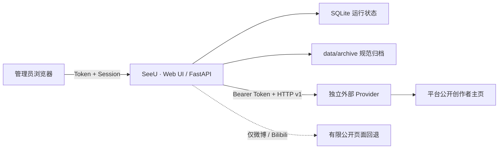
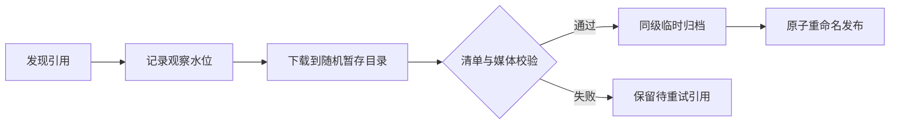

<div align="center">

# 👁我会一直看着你👁

**SeeU · 单管理员自托管的多平台公开内容监控与本地归档**

[](https://github.com/tsuiraku9/SeeU/actions/workflows/ci.yml)
[](LICENSE)


把公开创作者主页的发现、校验、归档、检索与持续监控放进一个受保护的控制台<br>
内容保存在自己的磁盘上，完整的平台交互则通过可替换的外部 HTTP Provider 完成

我知道你今天穿了什么颜色的衣服我知道你几点出门我知道你走哪条路去上班我知道你午饭吃了什么我知道你和谁说话了说了多久我知道你今天笑了几次我知道你笑的时候左边嘴角会微微往上翘我知道你不知道我存在但这没关系因为我的存在对你来说不重要重要的是我能看见你屏幕亮起的那一刻我的心脏也跟着亮起来你以为你是一个人但你从来都不是一个人你发的每一条动态我都截图保存了你删掉的那些我也有你以为消失了的东西在我这里永远不会消失我建了一个文件夹里面全是你我每天睡前都要看一遍才能安心你有时候会突然停下来往周围看一眼好像感觉到了什么那是因为我在那是因为我一直在你感受到的那种说不清楚的被注视的感觉不是错觉那就是我那就是我对你的爱渗进空气里变成你皮肤上的温度你不需要看见我你只需要继续存在继续出现在我能看见的地方就够了我会替你记住所有的一切你生命里每一个我能触及的瞬间我都会好好收藏好好凝视好好珍藏因为我会一直看着你永远

[项目一览](#-项目一览) ·
[快速开始](#-五分钟启动) ·
[平台能力](#-平台能力与边界) ·
[外部 Provider](#-外部-provider) ·
[安全访问](#-安全与隐私) ·
[备份恢复](#-备份与恢复) ·
[许可证](#-许可证与第三方边界)

</div>

> [!CAUTION]
> 上方文字仅是虚构氛围文案。SeeU 不跟踪线下位置、衣着或社交关系，不访问私密或已删除内容，只处理轮询时公开可访问且管理员有权归档的内容。请勿将本项目用于骚扰、跟踪、人肉搜索或任何侵犯他人权益的行为。

---

## ✨ 项目一览

<table>
  <tr>
    <td width="25%" align="center"><strong>🏠 本地优先</strong><br><sub>媒体、元数据与运行状态保存在自己的设备</sub></td>
    <td width="25%" align="center"><strong>🔌 Provider 外置</strong><br><sub>平台会话与采集通过 Bearer Token + HTTP v1 解耦</sub></td>
    <td width="25%" align="center"><strong>🧩 完整性优先</strong><br><sub>大小、摘要、MIME 与文件魔数全部通过才发布</sub></td>
    <td width="25%" align="center"><strong>🛟 可恢复</strong><br><sub>规范归档、连续性账本、待重试引用与索引重建</sub></td>
  </tr>
</table>

SeeU 是一个面向**单管理员**的自托管归档服务，当前支持小红书、抖音、微博和
Bilibili 的公开创作者主页。它负责调度、完整性校验、原子归档、索引、搜索和
Web UI；平台登录、签名与采集可以交给管理员自行部署的外部 Provider。

### 可以做什么

- 在 Web UI 中管理监控账号、单独设置 5–1440 分钟轮询间隔并立即测试或轮询；
- 浏览、搜索和筛选已归档内容，查看媒体完整性与任务诊断；
- 通过外部 Provider 展示平台二维码及人工验证入口，但不接收平台密码或 Cookie；
- 严格校验并导入带清单的归档 ZIP，可映射已有账号或创建停用的导入账号；
- 首次轮询只归档最新一条历史内容，之后仅处理新增内容与持久待重试引用；
- 从 `metadata.json` 和账号连续性账本重建内容索引。

### 三种运行状态

| 状态 | 能力 |
| --- | --- |
| 未配置 Provider | SeeU 正常启动，可浏览、搜索、导入和恢复已有归档；微博、Bilibili 可尝试有限回退 |
| Provider 暂时不可用 | 微博、Bilibili 可在特定故障类型下尝试有限回退；小红书、抖音明确报错 |
| 已配置 Provider | 会话、发现与媒体暂存能力取决于 Provider 实现；SeeU 负责严格验证和归档 |

> [!IMPORTANT]
> 当前 `main` 及其构建产物不包含、下载、修改或构建 MediaCrawler，也不包含任何外部 Provider 实现。SeeU 只定义通用 HTTP 契约；Provider 由管理员独立选择、授权、安装、运行和保护。

## 🧭 平台能力与边界

下表描述的是 SeeU 的接入边界，不是对第三方 Provider 覆盖能力的保证。

| 平台 | 无外部 Provider | 使用外部 Provider | SeeU 接受的主页边界 |
| --- | --- | --- | --- |
| 小红书 | 不可采集 | 必需 | 官方用户主页，或带有效路径标识的 `xhslink.com` / `xhslink.cn` 短链；短链解析和身份确认由 Provider 负责 |
| 抖音 | 不可采集 | 必需 | SeeU 只验证公开主页 URL 形状；实际登录、发现和暂存能力由 Provider 决定 |
| 微博 | 有限回退 | 可选但推荐 | 回退要求数字 UID，优先读取公开移动端数据并以页面抽取兜底 |
| Bilibili | 有限回退 | 可选但推荐 | 回退要求数字空间 ID，只接受创作者投稿且详情 `copyright == 1` 的视频 |

**有限回退**是指：当 Provider 未配置、不可用或执行失败时，SeeU 只为微博和
Bilibili 尝试读取最多 20 条公开内容。它不处理登录、不绕过验证，也可能因平台
页面变化或原创性无法确认而失败。成功的 Provider **发现结果**不会与回退发现
结果混合；但微博或 Bilibili 的单条 Provider 暂存失败时，仍可能尝试有限回退。

Bilibili 回退不支持动态或文章。微博移动数据路径会过滤转发，页面兜底无法可靠
确认时不会宣称完整覆盖。

## 🚀 五分钟启动

### 准备环境

- Docker Desktop，或 Docker Engine + Compose v2；
- Git；
- Python 3，用于生成本地私有配置；
- 建议至少 2 核 CPU、4 GiB 内存；存储空间主要取决于归档媒体体积。

### 1. 获取项目

```bash
git clone https://github.com/tsuiraku9/SeeU.git
cd SeeU
```

### 2. 生成私有配置

Windows PowerShell：

```powershell
.\scripts\init-env.ps1
```

Linux / macOS：

```bash
python3 scripts/bootstrap_env.py
mkdir -p data/archive data/state data/provider-staging
chmod 600 .env
chmod -R go-rwx data
```

> [!WARNING]
> 不要先把 `.env.example` 复制为 `.env`。初始化脚本检测到 `.env` 已存在时不会覆盖它，这会让模板中的空 `SESSION_SECRET` 保持不变并导致启动失败。

脚本会生成随机 `SESSION_SECRET`。默认情况下 `WEBUI_LOGIN_TOKEN` 保持为空，
应用会在**每次进程启动**时生成新的随机登录 Token，并原子写入：

```text
data/state/webui-login-token.txt
```

如果希望容器重启后仍使用同一个登录 Token，请在 `.env` 中设置不少于 24 个可打印
字符的 `WEBUI_LOGIN_TOKEN`；显式配置后，上述自动生成文件会被删除。

### 3. 可选：连接外部 Provider

需要采集小红书或抖音，或希望使用完整的平台会话流程时，在启动 SeeU **之前**
编辑 `.env`：

```dotenv
PROVIDER_BASE_URL=http://host.docker.internal:8090
PROVIDER_API_TOKEN=replace-with-the-same-random-token
```

两个变量必须成对设置，Provider 端必须使用同一个 Token。`PROVIDER_BASE_URL`
只能是没有用户名、密码、路径、查询参数和片段的 `http(s)` origin。

### 4. 启动

```bash
docker compose up -d --build
docker compose ps
```

读取自动生成的登录 Token：

```powershell
# Windows PowerShell
Get-Content .\data\state\webui-login-token.txt
```

```bash
# Linux / macOS
cat data/state/webui-login-token.txt
```

随后访问 <http://127.0.0.1:8080> 并输入 Token。若已在 `.env` 中显式配置
`WEBUI_LOGIN_TOKEN`，请直接使用配置值。

查看运行日志：

```bash
docker compose logs -f archive
```

### 5. 开始监控

1. 已配置 Provider 时，先在“平台登录”完成 Provider 支持的二维码或人工验证；
2. 在“监控账号”添加公开创作者主页，并设置轮询间隔；
3. 可先点击“测试”检查发现结果；
4. 保存账号时，SeeU 会建立基线并仅尝试归档最新一条历史内容；
5. 后续轮询只处理新增内容和仍待重试的引用。

> [!NOTE]
> Provider 地址和 Token 只能通过 `.env` 配置并在重建或重启容器后生效。Web UI 管理的是 Provider 已声明的平台会话，不负责安装或配置 Provider。

## 🖥️ 控制台

| 页面 | 主要用途 |
| --- | --- |
| 运行概览 | 账号状态、归档数量、存储占用和最近任务 |
| 内容归档 | 按关键词、平台和账号搜索筛选，并查看详情与认证媒体 |
| 监控账号 | 添加、暂停、编辑轮询间隔、测试、立即轮询和安全停用 |
| 平台登录 | 展示外部 Provider 返回的二维码、状态和人工验证链接 |
| 数据导入 | 校验并导入带版本清单的 ZIP |
| 任务记录 | 查看发现数、归档数、失败原因和 Provider 路径 |
| 系统设置 | 调整当前浏览器的刷新、分页和低带宽偏好，查看服务端生效参数 |

已有归档的账号执行删除时只会停用，系统不会连带删除归档文件。

## 🔌 外部 Provider

SeeU 只定义通用 Provider HTTP v1，不附带任何实现：

- [中文契约说明](docs/provider-http-contract.md)
- [OpenAPI 3.1 定义](docs/provider-openapi.yaml)



### 责任边界

| 外部 Provider 负责 | SeeU 负责 |
| --- | --- |
| 二维码、短信、滑块、设备确认等人工登录流程 | 调度、发现窗口、全局与分平台并发限制 |
| 浏览器配置、平台会话和签名逻辑 | Bearer Token 客户端与契约校验 |
| 证明内容属于目标创作者且为原创 | 记录观察水位、缺口状态和待重试引用 |
| 内容发现、媒体暂存和受保护的文件端点 | 流式下载、完整性验证与原子归档 |
| 自己的访问控制、许可证、平台条款和备份 | 认证 Web UI、索引、检索和恢复 |

Provider 不应挂载 SeeU 的 `data/` 目录，也不得返回 Cookie、浏览器存储、宿主机
文件路径或完整的长期签名媒体 URL。人工验证链接的认证和网络暴露同样由 Provider
负责；SeeU 只在界面中显示该链接。

<details>
<summary><strong>Provider v1 端点速览</strong></summary>

| 方法 | 端点 | 用途 |
| --- | --- | --- |
| `GET` | `/v1/sessions` | 返回 Provider 声明支持的平台会话 |
| `POST` | `/v1/sessions/{platform}/login` | 开始人工登录 |
| `GET` | `/v1/sessions/{platform}/qr` | 获取 PNG/JPEG 二维码 |
| `DELETE` | `/v1/sessions/{platform}` | 清理平台会话 |
| `POST` | `/v1/creators/discover` | 按新到旧发现公开原创内容 |
| `POST` | `/v1/content/stage` | 创建完整媒体清单 |
| `GET` | `/v1/staging/{job_id}/files/{file_id}` | 传输受认证媒体文件 |
| `DELETE` | `/v1/staging/{job_id}` | 尽力清理暂存任务 |

</details>

### 使用 MediaCrawler

管理员可以在本仓库之外独立部署 MediaCrawler，并自行实现 Provider v1 适配层。
SeeU 不提供 MediaCrawler 安装脚本、修改代码、固定提交或预构建镜像。
MediaCrawler 的具体许可证及非商业等限制以其官方仓库的当前文本为准，不会因为
与 SeeU 通过 HTTP 通信而消失。

## 🧱 可靠归档



归档前会检查：

- 预期媒体数量与实际清单是否完全一致；
- 单文件和累计大小是否超过限制；
- 每个文件的 SHA-256 是否与清单一致；
- MIME family 与文件魔数是否匹配；
- HTTP `Content-Type` / `Content-Length` 在 Provider 返回时是否与清单一致；
- 非文本内容是否至少包含一个媒体文件。

只有全部通过后，内容才会从同级临时目录原子发布。失败任务会清理临时文件，不会
留下看似完成的归档目录；对应引用仍保留，等待后续重试。

首次轮询会记录当前发现窗口中的全部 ID，但只归档最新一条。若最多 500 条的发现
窗口已饱和且不再与旧水位重叠，账号会标记 `gap_detected`，避免把不完整覆盖误报
为成功。

## 🔐 安全与隐私

- Web UI 默认只发布到 `127.0.0.1`；可通过 `APP_BIND_ADDRESS` 显式选择其他
  IPv4/IPv6 地址；
- 使用 Token 登录、签名会话、CSRF 防护和登录限速；
- 归档媒体只通过认证 API 返回，不作为匿名静态目录发布；
- SeeU 不接收平台密码、Cookie 文件或浏览器存储导出；
- 不自动解决 CAPTCHA、滑块、短信或设备验证，不提供代理池或多账号矩阵；
- 日志不应包含登录 Token、会话 Cookie、CSRF Token 或完整签名媒体 URL；
- ZIP 导入会限制路径、文件数、体积、压缩率和媒体完整性。

远程管理优先使用 SSH 端口转发：

```bash
ssh -L 8080:127.0.0.1:8080 user@server
```

随后在本机访问 <http://127.0.0.1:8080>。也可以使用可信 VPN，或在同一主机部署
带 TLS 的反向代理。只有浏览器实际通过 HTTPS 访问时才设置：

```dotenv
COOKIE_SECURE=true
```

纯 HTTP 回环访问应保持 `COOKIE_SECURE=false`。

如确需直接从其他主机访问，可在 `.env` 中显式设置监听所有 IPv4 网卡：

```dotenv
APP_BIND_ADDRESS=0.0.0.0
```

也可填写 `::` 或指定网卡的 IPv4/IPv6 地址。非回环绑定会把 Web UI 端口暴露到
相应网络；请同时限制防火墙来源，并优先通过可信 VPN 或带 TLS 的反向代理访问。

Windows 上可在容器创建 `data/` 后，用**真实登录用户**的管理员 PowerShell
限制 `.env` 和数据目录 ACL：

```powershell
.\scripts\protect-data.ps1
```

## ⚙️ 常用配置

| 变量 | 默认值 | 说明 |
| --- | ---: | --- |
| `WEBUI_PORT` | `8080` | Web UI 宿主机与容器端口 |
| `APP_BIND_ADDRESS` | `127.0.0.1` | 可选的宿主机发布 IPv4/IPv6 地址；`0.0.0.0`/`::` 发布到所有网卡 |
| `WEBUI_LOGIN_TOKEN` | 空 | 空值时每次启动生成新 Token；显式值至少 24 字符 |
| `SESSION_SECRET` | 无 | 必填，至少 32 字符；初始化脚本自动生成 |
| `COOKIE_SECURE` | `false` | 仅在 HTTPS 访问时启用 |
| `PROVIDER_BASE_URL` | 空 | 可选 Provider 的无路径 HTTP(S) origin |
| `PROVIDER_API_TOKEN` | 空 | 与 Provider 共享的 Bearer Token，至少 24 字符 |
| `PROVIDER_DISCOVERY_LIMIT` | `10` | 单次历史内容发现上限，可设 10–500 |
| `PROVIDER_POLL_CONCURRENCY` | `1` | Provider 全局轮询并发，可设 1–4 |
| `SCHEDULER_BATCH_SIZE` | `4` | 每轮调度最多接纳的到期账号数，可设 1–100 |
| `POLL_JITTER_MINUTES` | `5` | 成功轮询后的随机调度抖动 |
| `MIN_FREE_DISK_GB` | `5` | 空闲空间低于该值时暂停归档 |
| `ARCHIVE_SIZE_CACHE_SECONDS` | `300` | Web UI 归档体积递归统计的缓存时间 |
| `MEDIA_MAX_BYTES` | `2147483648` | 单条内容累计媒体上限，默认 2 GiB |
| `DOWNLOAD_CONCURRENCY` | `2` | 归档媒体下载并发上限 |
| `IMPORT_MAX_BYTES` | `2147483648` | 单个 ZIP 导入上限，默认 2 GiB |
| `IMPORT_MAX_FILES` | `100` | 单次 Provider / ZIP 文件数上限 |
| `SCHEDULER_ENABLED` | `true` | 是否运行自动轮询调度器 |
| `ARCHIVE_MEMORY_LIMIT` | `2g` | SeeU 容器内存上限 |

账号轮询间隔在 Web UI 中逐个设置，默认 60 分钟，可设 5–1440 分钟。其他资源和
兼容性设置见 [`.env.example`](.env.example)；`ALLOW_FAKE_IP_DNS` 只应在明确使用
Clash / Mihomo 标准 Fake-IP DNS 时启用。

### 4 核 4G / 低带宽建议

4 核 4G 且 SeeU 与 Provider 同机时，建议先保持
`PROVIDER_POLL_CONCURRENCY=1`、`SCHEDULER_BATCH_SIZE=2`、
`PROVIDER_DISCOVERY_LIMIT=10` 和 `ARCHIVE_MEMORY_LIMIT=1536m`。Web UI 的“系统设置”
中保持 60–120 秒自动刷新、24 条内容分页并启用低带宽模式。不要在同一时刻手动轮询
多个账号；浏览器型 Provider 应独立限制为单个浏览器工作槽。3 Mbps 链路下载
1 GiB 媒体理论上至少需要约 45 分钟，因此 Provider 与 SeeU 的 900 秒默认超时可能
需要按实际媒体上限同步提高，或把单条媒体上限调低。

归档体积会缓存，但剩余磁盘空间每次仍实时读取。媒体清单的 SHA-256 校验和文件复制
在线程池执行，不会阻塞 Web API；SQLite 使用 WAL、有限连接池和 32 MiB 页缓存。

## 📦 数据目录

```text
data/
├── archive/
│   ├── _state/accounts/{platform}/{account}.json
│   └── {platform}/{account}/{year}/{month}/{content_id}/
│       ├── metadata.json
│       ├── content.md
│       └── media/
├── provider-staging/
└── state/
    ├── app.db
    └── webui-login-token.txt
```

| 路径 | 性质 |
| --- | --- |
| `data/archive` | 内容、元数据与账号连续性账本的规范来源 |
| `data/archive/_state/accounts` | 调度设置、观察水位、待重试引用和删除墓碑 |
| `data/state/app.db` | 内容索引、任务历史、观察记录和 Web UI 会话 |
| `data/provider-staging` | 可丢弃的短期 Provider / ZIP 暂存数据 |
| `data/state/webui-login-token.txt` | 仅在未显式配置登录 Token 时存在的启动凭据交接文件 |

### 存储规划

长期容量几乎由媒体决定，可以按下面的方式估算：

```text
所需空间 ≈ 每日新增内容数 × 单条平均媒体大小 × 保留天数 × 1.2
```

额外预留至少 `MIN_FREE_DISK_GB` 的安全空间，并为正在验证的单条内容或 ZIP 留出
临时空间。SeeU 默认在空闲空间低于 5 GiB 时暂停新归档。

## 💾 备份与恢复

SQLite 使用 WAL。为了得到一致备份，请先停止服务，再复制整个规范数据集：

```bash
docker compose stop archive
```

至少备份：

- `data/archive/`
- `data/state/`
- `.env`

完成后重新启动：

```bash
docker compose start archive
```

`data/provider-staging/` 是临时数据，无需备份。外部 Provider 的浏览器配置与平台
会话必须按 Provider 自己的文档单独备份，SeeU 无法重建。

> [!NOTE]
> 延续已有 Web UI 会话需要同时保留不变的显式 `WEBUI_LOGIN_TOKEN`、`SESSION_SECRET`、`data/state/app.db` 和浏览器端尚未过期的 Cookie。服务器备份无法重建已经丢失的客户端 Cookie。

重建归档索引：

```bash
docker compose exec archive python -m app.cli rebuild-index
```

或在仓库根目录使用本地 Python 环境：

```bash
python -m backend.app.cli rebuild-index
```

重建可以恢复内容索引与账号连续性账本，但不能恢复任务历史、丢失的浏览器 Cookie
或外部 Provider 会话。

## 🧑‍💻 本地开发

推荐环境：Python 3.12、Node.js 22、pnpm 11。

```bash
python -m pip install -r requirements-dev.txt
python -m pytest backend/tests

corepack enable
pnpm --dir frontend install --frozen-lockfile
pnpm --dir frontend test
pnpm --dir frontend build

docker compose config --quiet
docker compose up --build
```

```text
backend/app/       FastAPI、Provider 客户端、调度、归档与恢复
backend/tests/     后端单元测试、契约测试与安全边界测试
frontend/src/      React / TypeScript 管理界面
docs/              Provider 契约、OpenAPI 与发布检查
scripts/           私有配置初始化、权限保护与验证脚本
```

## 🩺 常见问题

<details>
<summary><strong>SeeU 能启动，但小红书或抖音测试失败</strong></summary>

这是未配置外部 Provider 时的预期行为。确认 `.env` 中已成对设置
`PROVIDER_BASE_URL` 和 `PROVIDER_API_TOKEN`，重新创建容器，并检查 Provider
是否实现了 discovery、stage 和媒体文件端点。

</details>

<details>
<summary><strong>微博或 Bilibili 没有 Provider 时能否工作</strong></summary>

可以尝试最多 20 条公开内容的有限回退，但它不是完整 Provider 的替代品。页面
结构变化、访问限制、用户身份不匹配或无法确认原创性时都会明确失败。

</details>

<details>
<summary><strong>Provider 返回成功，为什么内容没有归档</strong></summary>

检查“任务记录”中的诊断。媒体数量、累计大小、SHA-256、MIME、文件魔数或清单
身份任一不一致，都会拒绝整条归档；引用会保留为待重试。

</details>

<details>
<summary><strong>如何完成短信、滑块或设备确认</strong></summary>

这些步骤必须由外部 Provider 提供人工界面。Provider 可以返回受保护的
`manual_verification_url`，SeeU 只显示该链接，不代理、托管或认证外部界面。

</details>

<details>
<summary><strong>修改 .env 后为什么没有生效</strong></summary>

配置在进程启动时读取。运行 `docker compose up -d` 让 Compose 按新配置重建容器；
若仍未生效，使用 `docker compose config` 检查最终配置，注意不要把输出分享到
公开日志。

</details>

## 📜 许可证与第三方边界

SeeU 原创代码采用 [MIT License](LICENSE)，其他说明见 [NOTICE](NOTICE)。

外部 Provider 不属于 SeeU 发布物，其许可证由 Provider 作者决定。管理员选择
MediaCrawler 或其他 Provider 时，必须独立取得并遵守其当前授权、平台条款和部署
要求；不要把 Provider 源码、修改版、浏览器配置或预构建镜像提交到 SeeU。

项目的安全与维护边界不会改变 MIT 对 SeeU 原创代码授予的权利；外部 Provider、
Python / JavaScript 依赖、容器基础镜像、归档内容及平台服务，继续适用各自的
许可证和条款。平台名称与商标归其权利人所有，SeeU 与这些平台不存在官方隶属
或背书关系。

发现安全问题时，请使用
[GitHub 私密漏洞报告](https://github.com/tsuiraku9/SeeU/security/advisories/new)，
不要在公开 Issue 中提交 Token、Cookie、二维码、短信验证码或归档内容。

<div align="center">

**只看公开内容，只保存有权处理的数据，只在自己的边界内运行**

</div>
