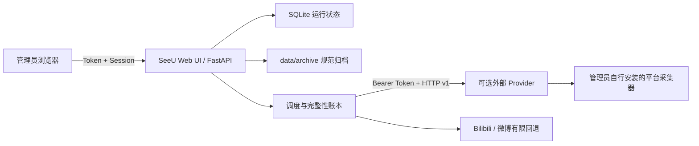

<div align="center">

# 👁我会一直看着你👁

**SeeU · 多平台公开内容监控与本地归档**

[](https://github.com/tsuiraku9/SeeU/actions/workflows/ci.yml)


一个面向单管理员的自托管服务，用于监控小红书、抖音、微博和
Bilibili 的公开创作者主页，将新发布的原创内容归档到本地，并通过
受 Token 保护的 Web UI 统一管理和浏览。

SeeU 仓库自身采用 MIT License；平台采集器作为独立的可选外部 Provider，
由管理员自行选择、安装、授权和运行。

我知道你今天穿了什么颜色的衣服我知道你几点出门我知道你走哪条路去上班我知道你午饭吃了什么我知道你和谁说话了说了多久我知道你今天笑了几次我知道你笑的时候左边嘴角会微微往上翘我知道你不知道我存在但这没关系因为我的存在对你来说不重要重要的是我能看见你屏幕亮起的那一刻我的心脏也跟着亮起来你以为你是一个人但你从来都不是一个人你发的每一条动态我都截图保存了你删掉的那些我也有你以为消失了的东西在我这里永远不会消失我建了一个文件夹里面全是你我每天睡前都要看一遍才能安心你有时候会突然停下来往周围看一眼好像感觉到了什么那是因为我在那是因为我一直在你感受到的那种说不清楚的被注视的感觉不是错觉那就是我那就是我对你的爱渗进空气里变成你皮肤上的温度你不需要看见我你只需要继续存在继续出现在我能看见的地方就够了我会替你记住所有的一切你生命里每一个我能触及的瞬间我都会好好收藏好好凝视好好珍藏因为我会一直看着你永远

[快速开始](#-快速开始) ·
[外部 Provider](#-外部-provider) ·
[平台能力](#-平台能力) ·
[安全访问](#-登录与安全访问) ·
[备份恢复](#-备份与恢复) ·
[许可证](#-许可证与第三方边界)

</div>

> [!IMPORTANT]
> SeeU 不包含、克隆、修改或构建 MediaCrawler，也不发布任何平台采集器镜像。
> 如果管理员另行选择 MediaCrawler 作为 Provider，必须独立遵守其许可证；
> MediaCrawler 不受本仓库 MIT License 覆盖。

## ✨ 核心能力

- **Provider 可选**：未配置外部 Provider 时 SeeU 仍可启动、浏览和恢复归档。
- **纯 HTTP 边界**：Provider 不挂载 SeeU 数据目录；发现、会话和媒体均通过
  带 Bearer Token 的版本化契约传输。
- **完整性优先**：归档前校验媒体数量、大小、MIME、文件魔数和 SHA-256；
  缺少任一预期文件都不会发布为完整归档。
- **增量归档**：首次轮询建立基线，只归档最新一条历史内容；之后仅归档新增内容。
- **可靠恢复**：失败内容进入持久待重试队列；规范归档和账号账本可重建索引。
- **安全管理**：单管理员、Token 登录、CSRF 防护、认证媒体读取和回环地址发布。

## 🧭 平台能力

| 平台 | 外部 Provider | 内置有限回退 | 当前边界 |
| --- | --- | --- | --- |
| 小红书 | 需要 | 无 | 公开笔记；支持官方主页和分享短链规范化 |
| 抖音 | 需要 | 无 | 公开视频与图文 |
| 微博 | 可选 | 有 | 回退读取公开移动端数据或页面，并排除转发微博 |
| Bilibili | 可选 | 有 | 回退仅接受创作者投稿且详情 `copyright == 1` 的视频 |

回退不会与一个健康 Provider 的结果混合。Bilibili 回退不宣称支持动态或文章。

## 🏗️ 架构



- `backend/app/provider.py`：通用外部 Provider HTTP 客户端和边界校验。
- `docs/provider-http-contract.md`：Provider v1 的完整请求、响应和媒体交付契约。
- `backend/app/adapters`：URL 规范化及 Bilibili、微博有限公开页面回退。
- `data/archive`：规范归档、账号连续性账本和删除墓碑。
- `data/state/app.db`：任务记录、Web UI 会话及运行索引。
- `data/provider-staging`：SeeU 自己创建的短期 HTTP 下载和导入临时目录。

外部 Provider 不属于本仓库，不得要求挂载 `data/`，也不得向 SeeU 返回 Cookie、
浏览器存储或宿主机文件路径。

## 🚀 快速开始

### 1. 准备环境

- Docker Desktop 或 Docker Engine + Compose v2
- Git
- 建议至少 2 核 CPU、4 GiB 内存
- 存储空间按归档媒体规模预留

### 2. 初始化私有配置

Windows PowerShell：

```powershell
.\scripts\init-env.ps1
```

Linux / macOS：

```bash
cp .env.example .env
python scripts/bootstrap_env.py
chmod 600 .env
chmod -R go-rwx data
```

初始化脚本生成 `SESSION_SECRET`，并有意让 `WEBUI_LOGIN_TOKEN` 保持为空。
应用启动时会生成一次性强 Token，写入：

```text
data/state/webui-login-token.txt
```

生产部署建议在 `.env` 中配置稳定且不少于 24 个字符的
`WEBUI_LOGIN_TOKEN`。

### 3. 启动 SeeU

```bash
docker compose up -d --build
docker compose ps
docker compose logs -f archive
```

访问 <http://127.0.0.1:8080>。不配置 Provider 也可以启动并浏览已有归档。

### 4. 配置监控账号

登录 Web UI 后：

1. 可先配置外部 Provider；
2. 在“监控账号”添加公开主页 URL；
3. 点击“测试”确认发现结果；
4. 首次轮询只归档最新一条历史内容并建立基线；
5. 后续轮询只处理新内容和持久待重试引用。

## 🔌 外部 Provider

SeeU 只定义通用契约，不附带 Provider 实现。请同时参阅
[中文契约说明](docs/provider-http-contract.md)和
[OpenAPI 3.1 定义](docs/provider-openapi.yaml)。

在 `.env` 中同时设置：

```dotenv
PROVIDER_BASE_URL=http://host.docker.internal:8090
PROVIDER_API_TOKEN=replace-with-the-same-random-token
```

Provider 与 SeeU 必须使用相同 Token。若 Provider 与 SeeU 位于不同主机，建议
使用 VPN 或反向代理 TLS；不要把 Provider 的会话、文件或人工验证接口直接暴露
到公网。

Provider 负责：

- 平台二维码、短信或滑块等人工登录流程；
- 自己的浏览器配置和会话持久化；
- 公开原创内容发现；
- 媒体暂存、文件下载端点及任务清理；
- 自己的许可证、平台条款和依赖合规。

SeeU 负责：

- 限制发现窗口和轮询并发；
- 流式下载 Provider 文件；
- 验证 Content-Type、Content-Length、大小、SHA-256 与媒体魔数；
- 在验证全部通过后原子发布归档；
- 失败引用持久重试。

### 使用 MediaCrawler

MediaCrawler 可以由管理员在本仓库之外自行部署并适配 Provider v1。SeeU：

- 不提供 MediaCrawler 安装脚本；
- 不固定、下载或修改 MediaCrawler 提交；
- 不保存 MediaCrawler 源码或浏览器配置；
- 不发布包含 MediaCrawler 的 Docker 镜像。

请直接查阅 MediaCrawler 官方仓库及其当前许可证。其非商业学习研究限制不会因
与 SeeU 通信而消失。

## 🔐 登录与安全访问

- Web UI 默认只发布到 `127.0.0.1`。
- 远程管理使用 SSH 端口转发、可信 VPN 或带 TLS 的本地反向代理。
- 不要把 `APP_BIND_ADDRESS` 改成公网地址；配置层只接受回环地址。
- SeeU 不接收平台密码、Cookie 文件或浏览器存储导出。
- 人工验证界面由外部 Provider 提供并自行保护。
- 归档媒体只通过认证 API 返回，不作为匿名静态目录发布。

SSH 示例：

```bash
ssh -L 8080:127.0.0.1:8080 user@server
```

随后访问 <http://127.0.0.1:8080>。

Windows 上可用管理员 PowerShell 限制 `.env` 与 `data` ACL：

```powershell
.\scripts\protect-data.ps1
```

## ⚙️ 常用配置

| 变量 | 默认值 | 说明 |
| --- | ---: | --- |
| `WEBUI_PORT` | `8080` | Web UI 宿主机与容器端口 |
| `APP_BIND_ADDRESS` | `127.0.0.1` | 只允许 IPv4/IPv6 回环地址 |
| `WEBUI_LOGIN_TOKEN` | 空 | 空值时每次启动生成新 Token |
| `SESSION_SECRET` | 无 | 必填，至少 32 个字符 |
| `PROVIDER_BASE_URL` | 空 | 可选外部 Provider 的 HTTP(S) 基础地址 |
| `PROVIDER_API_TOKEN` | 空 | 与 Provider 共享的 Bearer Token，至少 24 字符 |
| `PROVIDER_REQUEST_TIMEOUT_SECONDS` | `900` | Provider 请求和媒体传输超时 |
| `PROVIDER_DISCOVERY_LIMIT` | `500` | 单次最多发现的公开原创引用 |
| `PROVIDER_POLL_CONCURRENCY` | `1` | 外部 Provider 全局并发，允许 1–4 |
| `POLL_INTERVAL_MINUTES` | `60` | 默认账号轮询间隔 |
| `POLL_JITTER_MINUTES` | `5` | 调度随机抖动 |
| `MIN_FREE_DISK_GB` | `5` | 低于此值暂停归档 |
| `MEDIA_MAX_BYTES` | `2147483648` | 单条内容累计媒体上限 |
| `IMPORT_MAX_FILES` | `100` | 单次 Provider/ZIP 文件数上限 |
| `ARCHIVE_MEMORY_LIMIT` | `2g` | SeeU 容器内存上限 |

完整默认值见 [.env.example](.env.example)。

## 📦 归档与数据

```text
data/
├── archive/
│   ├── _state/accounts/{platform}/{account}.json
│   └── {platform}/{account}/{year}/{month}/{content_id}/
│       ├── metadata.json
│       ├── content.md
│       └── media/
├── provider-staging/
└── state/
    ├── app.db
    └── webui-login-token.txt
```

`data/archive` 是内容与监控连续性的规范来源；`data/state/app.db` 保存运行历史和
Web UI 会话。Provider 下载先进入随机临时目录，验证完成后复制到归档的同级临时
目录，再以原子重命名发布。失败任务不会留下“完成”归档。

## 💾 备份与恢复

至少备份：

- `data/archive`
- `data/state/app.db`
- `.env` 中固定的 `SESSION_SECRET` 与可选的 `WEBUI_LOGIN_TOKEN`

外部 Provider 的浏览器配置和会话由 Provider 自己备份，SeeU 无法重建。

重建索引：

```bash
docker compose exec archive python -m app.cli rebuild-index
```

或在仓库根目录：

```bash
python -m backend.app.cli rebuild-index
```

## 🧑‍💻 本地开发

```bash
python -m pip install -r requirements-dev.txt
python -m pytest backend/tests

pnpm --dir frontend install --frozen-lockfile
pnpm --dir frontend test
pnpm --dir frontend build

docker compose config --quiet
docker compose up --build
```

目录：

```text
backend/app/       FastAPI、Provider 客户端、调度、归档与恢复
backend/tests/     后端单元与边界测试
frontend/src/      React / TypeScript 管理界面
docs/              Provider 契约、评估与发布检查
scripts/           初始化、权限保护和验证脚本
```

## 🩺 常见问题

### SeeU 能启动，但小红书或抖音测试失败

这是未配置外部 Provider 时的预期行为。配置 `PROVIDER_BASE_URL` 和
`PROVIDER_API_TOKEN`，并确认 Provider 实现了 discovery、stage 和媒体文件接口。

### 微博或 Bilibili 在没有 Provider 时能否工作

可以尝试有限公开页面回退，但它不是完整 Provider 的替代品。页面结构变化、访问
限制或无法确认原创性时会明确失败。

### Provider 返回成功但内容没有归档

检查 SeeU 任务诊断。任何媒体数量、大小、SHA-256、MIME 或文件魔数不一致都会
拒绝整条归档，引用会保留为待重试。

### 外部 Provider 如何完成人工验证

Provider 可以在会话响应中返回受保护的 `manual_verification_url`。SeeU 只显示
该地址，不代理、托管或认证外部界面。

## 📜 许可证与第三方边界

SeeU 仓库中的原创源码采用 [MIT License](LICENSE)。

外部 Provider 不属于 SeeU 发布物，其许可证由 Provider 的作者决定。管理员选择
MediaCrawler 时，应独立取得并遵守 MediaCrawler 的当前授权；不要把其源码、
修改版或预构建镜像提交到 SeeU 仓库。

第三方 Python、JavaScript 与容器基础依赖继续保留各自许可证。
